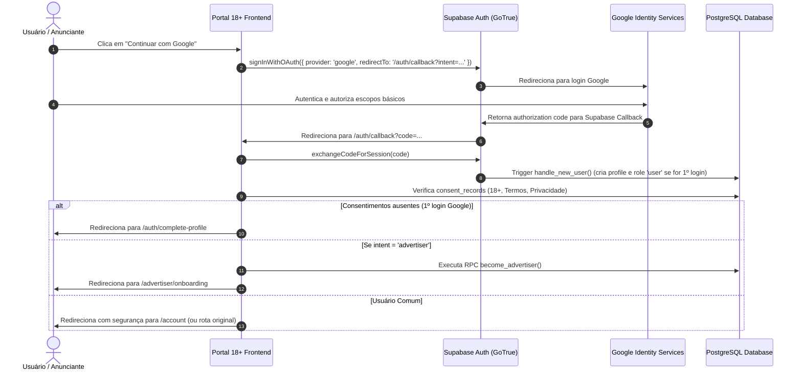

# Integração Google OAuth 2.0 (Sign-In & Sign-Up) — Portal 18+

Este documento orienta a configuração completa do provedor **Google OAuth** no Supabase Dashboard e no Google Cloud Console para o **Portal 18+**.

---

## 1. Visão Geral da Arquitetura

- **Biblioteca Autenticadora**: Supabase Auth (GoTrue) com fluxo PKCE SSR (`@supabase/ssr`).
- **Segurança de Credenciais**: As credenciais do Google (`Client ID` e `Client Secret`) ficam **exclusivamente** armazenadas no Supabase Dashboard (Auth Providers). Elas **nunca** são expostas em variáveis de ambiente públicas do frontend (`NEXT_PUBLIC_*`).
- **Callback Canônico**: `/auth/callback` na aplicação gerencia a troca do `code` por sessão de cookie, validação de redirecionamento seguro (anti-open redirect), verificação de consentimentos legais (18+, Termos, Privacidade) e conversão para anunciante quando aplicável.

---

## 2. Passo a Passo: Configuração no Google Cloud Console

1. **Acessar o Google Cloud Console**:
   - URL: [https://console.cloud.google.com/](https://console.cloud.google.com/)
   - Selecione ou crie um projeto (ex: `Portal18-Production` ou `Portal18-Auth`).

2. **Configurar a Tela de Consentimento OAuth (OAuth Consent Screen)**:
   - Vá em: **APIs & Services** > **OAuth consent screen**.
   - Tipo de Usuário: **External** (Externo).
   - Preencha os campos obrigatórios:
     - **App name**: `Portal 18+`
     - **User support email**: `contato@portal18.com` (ou e-mail de suporte administrativo)
     - **Developer contact information**: `tech@portal18.com`
     - **Authorized domains**: Adicione `supabase.co` e `portal18.vercel.app` (e seu domínio customizado).
   - **Scopes (Escopos)**:
     - Selecione apenas os escopos básicos não sensíveis:
       - `.../auth/userinfo.email`
       - `.../auth/userinfo.profile`
       - `openid`
   - Salve e publique o consent screen (ou mantenha em modo de teste adicionando e-mails autorizados se estiver em homologação).

3. **Criar Credenciais OAuth (OAuth 2.0 Client ID)**:
   - Vá em: **APIs & Services** > **Credentials** > **Create Credentials** > **OAuth client ID**.
   - Tipo de Aplicação: **Web application** (Aplicativo da Web).
   - Nome: `Portal 18+ Web Client`.
   - **Authorized JavaScript origins (Origens JavaScript autorizadas)**:
     - `http://localhost:3000` (desenvolvimento local)
     - `https://portal18.vercel.app` (produção Vercel)
     - `https://seudominio.com.br` (domínio canônico customizado)
   - **Authorized redirect URIs (URIs de redirecionamento autorizadas)**:
     - Copie a URL de callback do seu projeto Supabase:
       `https://<SEU-SUPABASE-PROJECT-ID>.supabase.co/auth/v1/callback`
   - Clique em **Create** (Criar).
   - Copie o **Client ID** e o **Client Secret** gerados.

---

## 3. Passo a Passo: Configuração no Supabase Dashboard

1. **Acessar o Dashboard do Supabase**:
   - URL: [https://supabase.com/dashboard/project/<SEU-PROJECT-ID>/auth/providers](https://supabase.com/dashboard/project/<SEU-PROJECT-ID>/auth/providers)
   - Selecione a aba **Authentication** > **Providers**.

2. **Ativar o Provedor Google**:
   - Localize **Google** e marque como **Enabled** (Ativo).
   - Cole o **Client ID** obtido no Google Cloud.
   - Cole o **Client Secret** obtido no Google Cloud.
   - Salve as alterações.

3. **Configurar URL Configuration (Site URL & Redirect URLs)**:
   - Vá em **Authentication** > **URL Configuration**.
   - **Site URL**: `https://portal18.vercel.app` (ou domínio final em produção).
   - **Redirect URLs (Allowlist)**:
     - `http://localhost:3000/**`
     - `https://portal18.vercel.app/**`
     - `https://seudominio.com.br/**`

---

## 4. Fluxo de Dados e Garantias de Segurança

---

## 5. Matriz de Status e Gates

| Item | Status | Observação |
|---|---|---|
| **Código Frontend & PKCE** | ✅ **CODE READY** | Supabase OAuth client, GoogleButton, 2-track selection, /auth/callback e /auth/complete-profile implementados. |
| **Proteção Open Redirect** | ✅ **IMPLEMENTED** | Whitelist estrita de URLs internas sanitizadas. |
| **Proteção de Role Injection** | ✅ **IMPLEMENTED** | Triggers do PostgreSQL descartam metadados arbitrários de role. |
| **Google Cloud Credentials** | ⏳ **PENDING DASHBOARD CONFIG** | Requer inserção do Client ID e Secret no Supabase Dashboard pelo administrador. |
